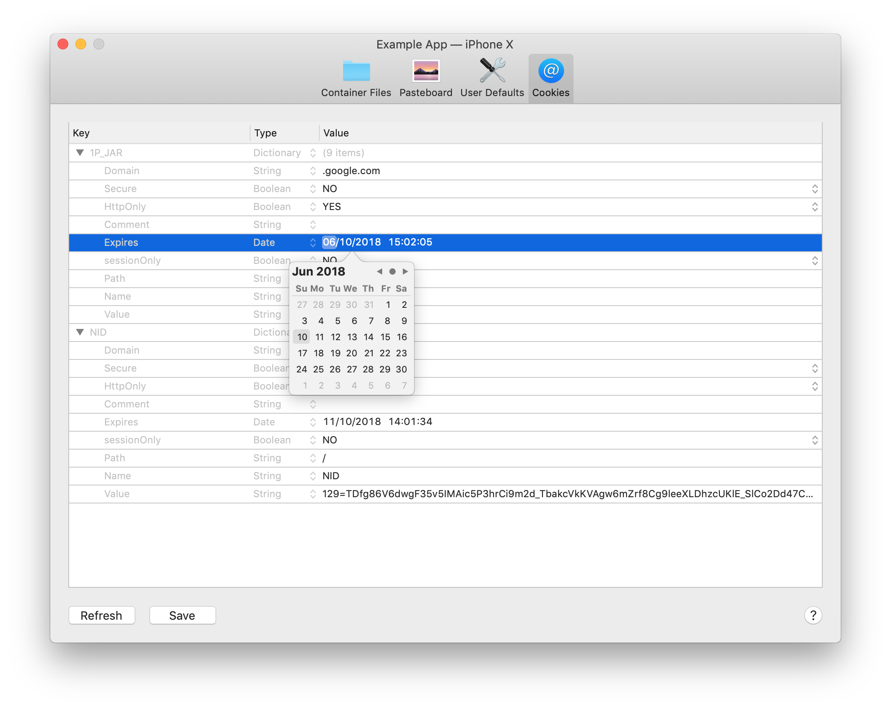
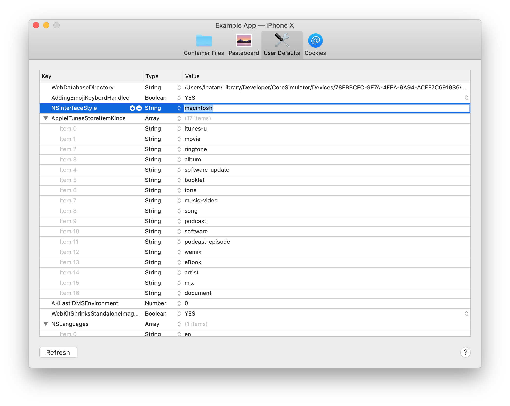

# LNPropertyListEditor

A property list editor for macOS, similar to Xcode's.





## Adding to Your Project

### Carthage

Add the following to your Cartfile:

```github "LeoNatan/LNPropertyListEditor"```

Make sure you follow the Carthage integration instructions [here](https://github.com/Carthage/Carthage#if-youre-building-for-ios-tvos-or-watchos).

### Manual

Drag the `LNPropertyListEditor.xcodeproj` project to your project, and add `LNPropertyListEditor.framework` to **Embedded Binaries** in your project target's **General** tab. Xcode should sort everything else on its own.

### CocoaPods

CocoaPods is not supported. There are many reasons for this. Instead of CocoaPods, use Carthage. You can continue using CocoaPods for for your other dependencies and Carthage for `LNPropertyListEditor`.

## Using the Framework

### Swift

While the framework is written in Objective C, it uses modern Objective C syntax, so using the framework in Swift should be very easy and intuitive.

### Project Integration

Import the module in your project:

```objective-c
@import LNPropertyListEditor;
```
