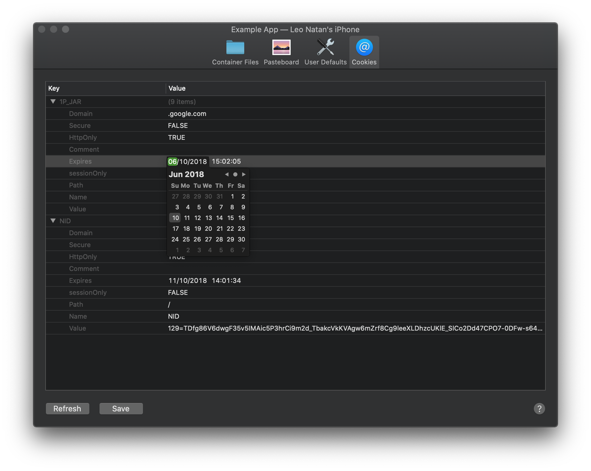
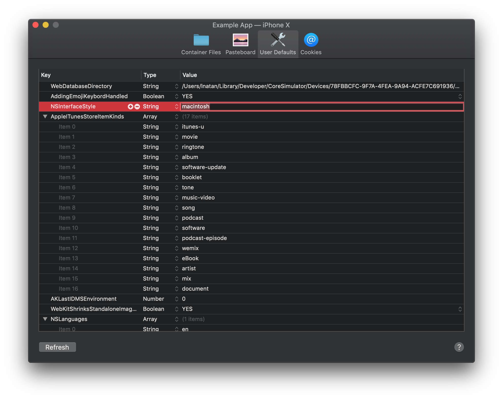

# LNPropertyListEditor

A property list editor for macOS, similar to Xcode's. Has full support for macOS Mojave light and dark appearance.





## Adding to Your Project

### Swift Package Manager

Swift Package Manager is the recommended way to integrate LNPropertyListEditor in your project.

LNPropertyListEditor supports SPM versions 5.1.0 and above. To use SPM, you should use Xcode 11 to open your project. Click `File` -> `Swift Packages` -> `Add Package Dependency`, enter `https://github.com/LeoNatan/LNPropertyListEditor`. Select the version you’d like to use.

You can also manually add the package to your Package.swift file:

```swift
.package(url: "https://github.com/LeoNatan/LNPropertyListEditor.git", from: "1.0")
```

And the dependency in your target:

```swift
.target(name: "BestExampleApp", dependencies: ["LNPropertyListEditor"]),
```

### Carthage

Add the following to your Cartfile:

```github "LeoNatan/LNPropertyListEditor"```

Make sure you follow the Carthage integration instructions [here](https://github.com/Carthage/Carthage#if-youre-building-for-ios-tvos-or-watchos).

### Manual

Drag the `LNPropertyListEditor.xcodeproj` project to your project, and add `LNPropertyListEditor.framework` to **Embedded Binaries** in your project target's **General** tab. Xcode should sort everything else on its own.

### CocoaPods

CocoaPods is not supported. There are many reasons for this. Instead of CocoaPods, use Carthage. You can continue using CocoaPods for for your other dependencies and Carthage for `LNPropertyListEditor`.

## Using the Framework

### Swift

While the framework is written in Objective C, it uses modern Objective C syntax, so using the framework in Swift should be very easy and intuitive.

### Project Integration

Import the module in your project:

```objective-c
@import LNPropertyListEditor;
```

### Usage

Either using Interface Builder or in code, add an `LNPropertyListEditor` view to your user interface.

To set a represented object, set the `propertyList` property.

```swift
guard let propertyListURL = Bundle.main.url(forResource: "Some", withExtension: "plist"),
   let propertyListData = try? Data(contentsOf: propertyListURL),
   let propertyListObject = try? PropertyListSerialization.propertyList(from: propertyListData, options: [], format: nil) as? [String: AnyObject] else {
	return
}

plistEditor.propertyListObject = propertyListObject
```

Supported object types: Dictionaries, arrays, strings, dates, datas, booleans and numbers (dictionaries and arrays can contains nested children of the aforementioned types).

#### Delegate

Implement the `LNPropertyListEditorDelegate` protocol to listen to various events, or control what aspects of the property list can be edited.

```swift
plistEditor.delegate = self
//...
func propertyListEditor(_ editor: LNPropertyListEditor, didChange node: LNPropertyListNode, changeType: LNPropertyListNodeChangeType, previousKey: String?) {
	switch changeType {
	case .insert:
		print("🎉")
	case .move:
		print("➡️")
	case .update:
		print("🔄")
	case .delete:
		print("🗑")
  @unknown default:
		fatalError()
	}
}
```

For full documentation, see the `LNPropertyListEditor.h` header.

#### Data Transformer

Implement the `LNPropertyListEditorDataTransformer` protocol to provide display and data transformations for your property list objects.

```swift
plistEditor.dataTransformer = self
//...
func propertyListEditor(_ editor: LNPropertyListEditor, displayNameFor node: LNPropertyListNode) -> String? {
	// ...
	if let key = node.key,
	   key == "CFBundleShortVersionString" {
		return "Bundle version string (short)"
	}
	//...
}
```

For full documentation, see the `LNPropertyListEditor.h` header.

## Acknowledgements

The framework uses:

* [HexFiend](https://github.com/HexFiend/HexFiend) © ridiculous_fish, 2011-2020

